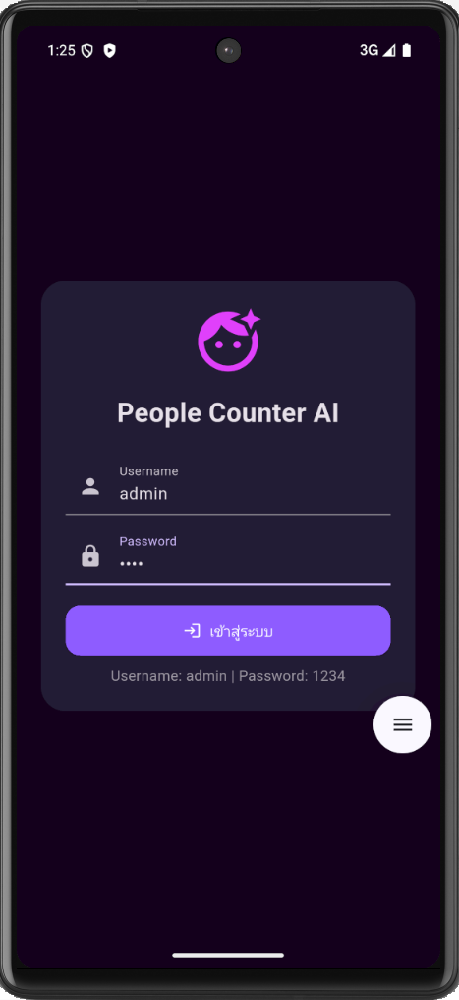
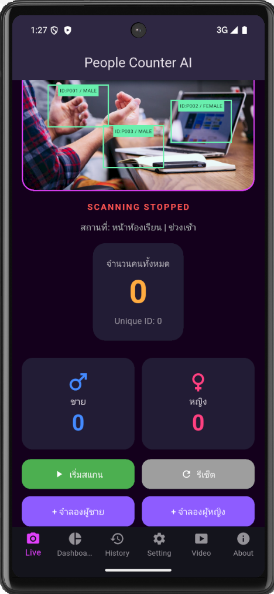
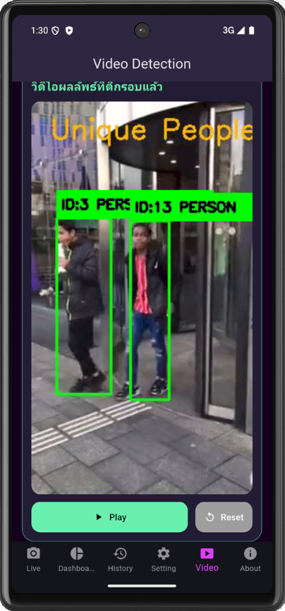
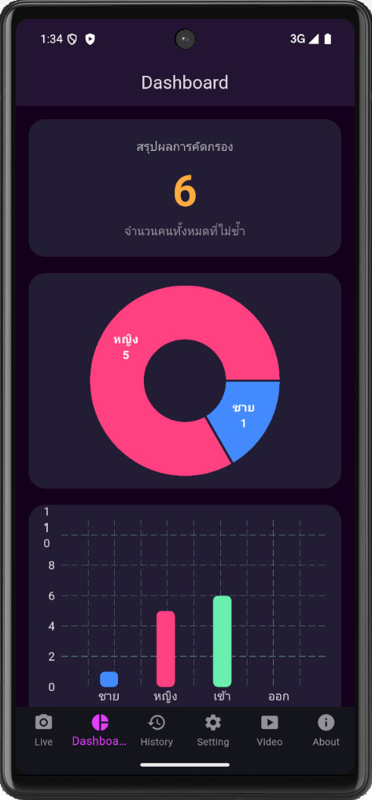
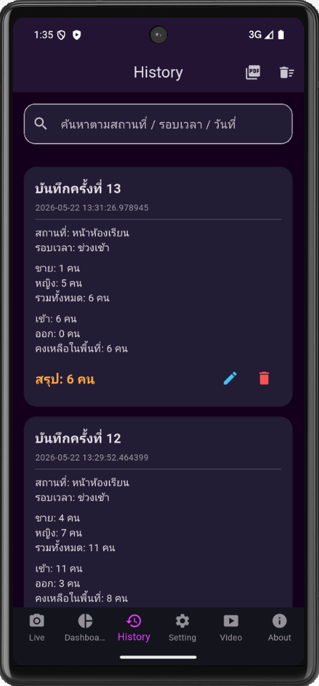
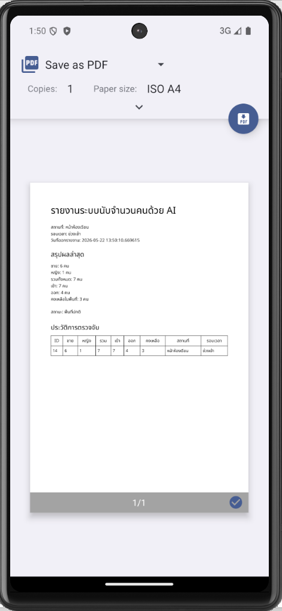

# People Counter AI

ระบบนับจำนวนคนด้วย AI จากวิดีโอ โดยใช้ Flutter, FastAPI และ YOLO

---

## รายละเอียดโครงงาน

โปรเจกต์ **People Counter AI** เป็นเทอมโปรเจกต์รายวิชา Mobile Application Development  
พัฒนาเป็นแอปพลิเคชันสำหรับนับจำนวนคนจากวิดีโอ โดยใช้ Flutter เป็นส่วนของ Mobile Application และใช้ FastAPI เป็น Web API สำหรับรับวิดีโอจากแอปไปประมวลผลด้วย YOLO และ OpenCV

ระบบสามารถตรวจจับบุคคลจากวิดีโอ แสดงจำนวนคนทั้งหมด จำนวนคนเข้า จำนวนคนออก จำนวนคนคงเหลือในพื้นที่ และแสดงผลข้อมูลผ่าน Dashboard รวมถึงสามารถบันทึกประวัติการตรวจจับลงฐานข้อมูล SQLite และส่งออกรายงานเป็น PDF ภาษาไทยได้

---

## วัตถุประสงค์ของโครงงาน

1. เพื่อพัฒนาแอปพลิเคชันนับจำนวนคนจากวิดีโอด้วย AI  
2. เพื่อศึกษาการเชื่อมต่อ Flutter กับ Web API ผ่าน FastAPI  
3. เพื่อประยุกต์ใช้ YOLO และ OpenCV สำหรับตรวจจับบุคคลจากวิดีโอ  
4. เพื่อจัดเก็บข้อมูลประวัติการตรวจจับด้วย SQLite  
5. เพื่อแสดงผลข้อมูลผ่าน Dashboard และส่งออกรายงาน PDF  

---

## เทคโนโลยีที่ใช้

| เทคโนโลยี | รายละเอียด |
|---|---|
| Flutter | พัฒนาแอปพลิเคชันมือถือ |
| Dart | ภาษาโปรแกรมหลักของ Flutter |
| Provider | จัดการสถานะข้อมูลภายในแอป |
| SQLite / sqflite | จัดเก็บข้อมูลประวัติการตรวจจับ |
| FastAPI | สร้าง Web API สำหรับรับวิดีโอ |
| Python | พัฒนา Backend และประมวลผลวิดีโอ |
| YOLO | ตรวจจับบุคคลจากวิดีโอ |
| OpenCV | อ่าน เขียน และวาดกรอบบนวิดีโอ |
| PDF / Printing | สร้างรายงาน PDF ภาษาไทย |

---

## ฟังก์ชันหลักของระบบ

- Login เข้าสู่ระบบ
- Live Count จำลองการนับจำนวนคน
- Video Detection ส่งวิดีโอไปตรวจจับด้วย YOLO
- Dashboard แสดงผลสรุปและกราฟ
- History แสดงประวัติการตรวจจับ
- CRUD ข้อมูลประวัติ ได้แก่ เพิ่ม อ่าน แก้ไข และลบข้อมูล
- Setting ตั้งค่าสถานที่ รอบเวลา และจำนวนคนที่ถือว่าหนาแน่น
- Export PDF ส่งออกรายงานภาษาไทย
- เชื่อมต่อ Web API ด้วย FastAPI
- ตรวจจับบุคคลจากวิดีโอด้วย YOLO และ OpenCV

---

## ความสามารถตามโจทย์ใบงานที่ 10

| เงื่อนไข | รายละเอียดในโปรเจกต์ |
|---|---|
| Provider | ใช้ PeopleProvider จัดการข้อมูลจำนวนคน ชาย หญิง เข้า ออก Dashboard และ History |
| Web API | ใช้ FastAPI เป็น Backend สำหรับรับวิดีโอและส่งผลลัพธ์กลับมายัง Flutter |
| CRUD | ใช้หน้า History สำหรับเพิ่ม อ่าน แก้ไข และลบข้อมูลประวัติ |
| sqflite | ใช้ SQLite ผ่าน sqflite สำหรับจัดเก็บประวัติในเครื่อง |
| Dashboard | แสดงผลด้วยกราฟและตัวเลขสรุป |
| PDF | Export รายงานภาษาไทยได้ |

---

## โครงสร้างโปรเจกต์

```text
people-counter-ai-term-project/
├── people_counter_ai/
│   ├── lib/
│   ├── assets/
│   ├── android/
│   └── pubspec.yaml
│
├── people_counter_yolo_api/
│   ├── main.py
│   ├── requirements.txt
│   ├── uploads/
│   └── results/
│
├── screenshots/
├── .gitignore
└── README.md
```

---

## ตัวอย่างหน้าจอแอปพลิเคชัน

### 1. หน้า Login

หน้าจอเข้าสู่ระบบสำหรับผู้ใช้งานก่อนเข้าใช้งานแอป



---

### 2. หน้า Live Count

หน้าจอจำลองการนับจำนวนคนแบบ Real-time พร้อมแสดงจำนวนคนเข้า ออก และคงเหลือในพื้นที่



---

### 3. หน้า Video Detection

หน้าจอเลือกวิดีโอ ส่งวิดีโอไปยัง FastAPI และแสดงวิดีโอผลลัพธ์ที่ตรวจจับบุคคลด้วย YOLO



---

### 4. หน้า Dashboard

หน้าจอแสดงผลสรุปจำนวนคนทั้งหมด ชาย หญิง เข้า ออก และกราฟแสดงข้อมูล



---

### 5. หน้า History

หน้าจอแสดงประวัติการตรวจจับ สามารถค้นหา แก้ไข และลบข้อมูลได้



---

### 6. หน้า PDF Report

หน้าจอรายงาน PDF ภาษาไทยที่สร้างจากข้อมูลประวัติการตรวจจับ



---

## การทำงานของระบบ

```text
Flutter App
    ↓
เลือกวิดีโอจากอุปกรณ์
    ↓
ส่งวิดีโอไปยัง FastAPI
    ↓
YOLO / OpenCV ตรวจจับบุคคลในวิดีโอ
    ↓
FastAPI ส่งผลลัพธ์กลับมายัง Flutter
    ↓
Provider อัปเดตข้อมูลในแอป
    ↓
Dashboard แสดงผล
    ↓
SQLite บันทึกประวัติ
    ↓
Export PDF รายงาน
```

---

## วิธีรัน Flutter App

```bash
cd people_counter_ai
flutter pub get
flutter run
```

---

## วิธีรัน FastAPI YOLO API

```bash
cd people_counter_yolo_api
python -m pip install -r requirements.txt
python -m uvicorn main:app --host 0.0.0.0 --port 8000
```

---

## การเชื่อมต่อ API

ถ้ารันผ่าน Android Emulator ให้ใช้ URL:

```text
http://10.0.2.2:8000
```

ถ้าทดสอบ API บนคอมพิวเตอร์ ให้เปิด:

```text
http://127.0.0.1:8000
```

---

## บัญชีทดสอบ

```text
Username: admin
Password: 1234
```

---

## ตัวอย่างผลลัพธ์

| รายการ | ผลลัพธ์ |
|---|---|
| จำนวนคนทั้งหมด | 7 คน |
| จำนวนชาย | 4 คน |
| จำนวนหญิง | 3 คน |
| จำนวนคนเข้า | 7 คน |
| จำนวนคนออก | 2 คน |
| จำนวนคนคงเหลือในพื้นที่ | 5 คน |

---

## ปัญหาที่พบและแนวทางแก้ไข

| ปัญหา | แนวทางแก้ไข |
|---|---|
| Android Emulator เรียก API ไม่ได้ | เปลี่ยนจาก 127.0.0.1 เป็น 10.0.2.2 |
| วิดีโอผลลัพธ์เล่นไม่ได้ | แปลงวิดีโอเป็น H.264 ก่อนส่งกลับ Flutter |
| PDF ภาษาไทยเป็นสี่เหลี่ยม | เพิ่มฟอนต์ NotoSansThai-Regular.ttf |
| YOLO ประมวลผลช้า | ใช้วิดีโอสั้นและลดจำนวนเฟรมที่ตรวจจับ |

---

## หมายเหตุ

- ต้องเปิด FastAPI Server ก่อนใช้งานหน้า Video Detection
- โฟลเดอร์ uploads และ results เป็นไฟล์ชั่วคราว จึงไม่จำเป็นต้องอัปโหลดขึ้น GitHub
- ไฟล์ yolov8n.pt ไม่จำเป็นต้องอัปโหลด เพราะระบบสามารถดาวน์โหลดใหม่ได้เมื่อรัน YOLO ครั้งแรก
- การจำแนกชาย/หญิงในโปรเจกต์นี้เป็นข้อมูลจำลองเพื่อใช้ประกอบ Dashboard และรายงาน PDF

---

## ผู้จัดทำ

เทอมโปรเจกต์รายวิชา Mobile Application Development  
หัวข้อ: People Counter AI